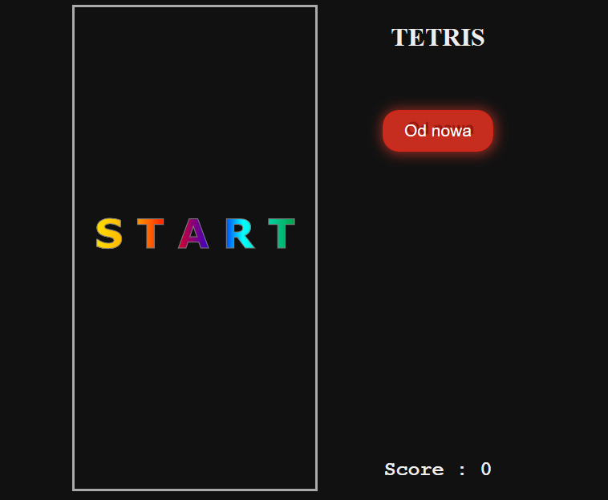
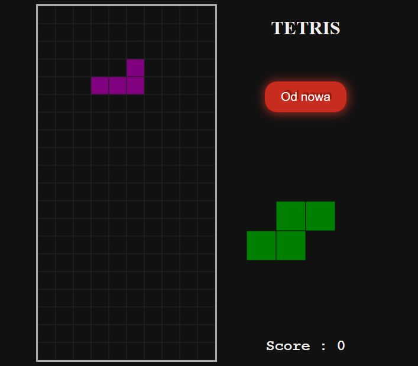
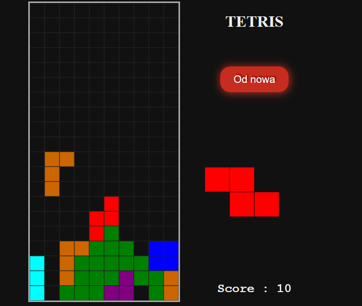

# tetris
My project with javascript.
I was inspired by example from the internet. 
I wanted to try my hand at JavaScript.

I used <canvas> element. I drew text on the Canvas to start game.

 I used second <canvas> to show next tetromino. I hide borders to look more aesthetically. 

source
https://www.youtube.com/watch?v=HEsAr2Yt2do
